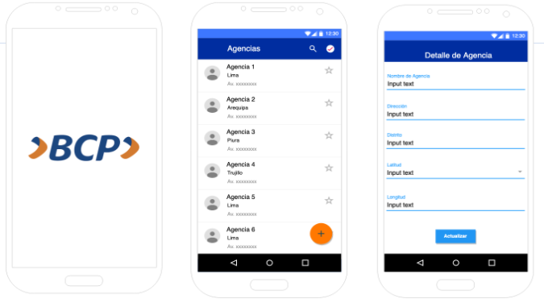

# BcpChallenge 😄

Proyecto  generado con [Angular CLI](https://github.com/angular/angular-cli) version 11.2.4.

Requerimientos funcionales:

 ✔️ Pantalla 1: Un loading simple que muestre la carga de la página. 
 ✔️ Pantalla 2: Se debe mostrar una lista de agencias del BCP, utilizando la data del archivo agencias.json, poner una imagen aleatoria para cada agencia.  
 ✔️ Pantalla 3: Por cada agencia se debe mostrar un detalle que permita actualizar la información, esta información debe ser actualizada en el Storage del dispositivo, de tal modo este disponible cuando se vuelva a ingresar a la aplicación. Debe permitir volver a la pantalla 2 donde muestre los datos actualizados de la agencia. 
 ✔️ En la pantalla 2 mostrar un mapa en base a las coordenadas de la agencia. 

## Ejecutar proyecto (Servidor de desarrollo)

Abrir consola de comando y seguir los siguientes pasos: 

1. Ejecutar comando `npm install`
2. Ejecutar comando `ng serve`
3. Navegar a `http://localhost:4200/`

---
BCP CHALLENGE | Desarrollado por Maria Cutipa Gonzales. 📍 Lima, 2021.
